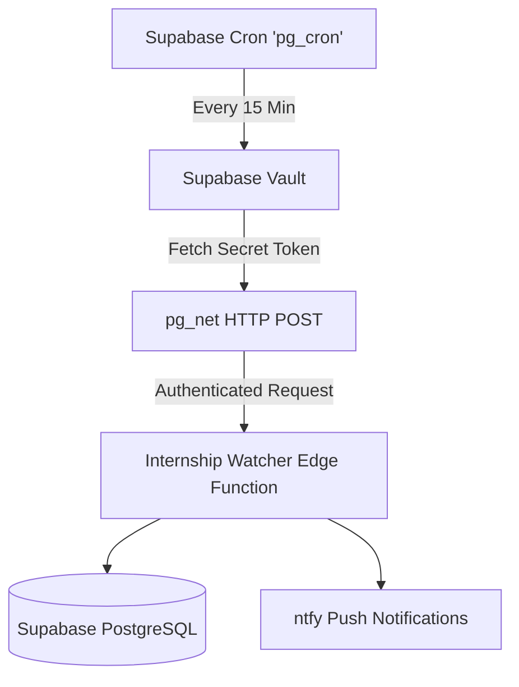

# Internship Watcher

An autonomous, idempotent workflow for aggregating, normalizing, filtering, cross-matching, and delivering software engineering internship opportunities.

## Architecture (Phases 1-6)

This workflow is fully integrated into a single, safe local execution pipeline:

1. **Source Ingestion:** Fetches raw JSON feeds from remote aggregators (ApplyGuy, Simplify). Independent source failures do not crash the pipeline.
2. **Normalization & Filtering:** Unifies disparate schemas into a standard `JobCandidate` and enforces baseline eligibility (e.g., active status, posted < 30 days ago, 2027 term).
3. **Persistence:** Saves accepted source records into `job_listings` in Supabase with `UNIQUE (source, source_job_id)`.
4. **Canonical Matching & Deduplication:** Cross-references URLs to merge duplicate job postings from different aggregators into a single `canonical_jobs` record.
5. **Discovery Events:** Creates `discovery_events` ONLY for genuinely new, deduplicated canonical opportunities.
6. **Notifications:** Delivers distinct discovery events via iOS push notifications using `ntfy`. Utilizes an atomic claim mechanism to prevent duplicate notifications during overlapping executions.
7. **Execution Summary:** Collects and prints precise execution metrics, outputting `SUCCESS`, `PARTIAL_SUCCESS` (nonzero exit code), or `FAILED`.

## Architecture (Phases 1-8)

This workflow executes fully autonomously in the cloud via Supabase:

1. **Source Ingestion:** Fetches raw JSON feeds from remote aggregators (ApplyGuy, Simplify).
2. **Normalization & Filtering:** Unifies disparate schemas into a standard `JobCandidate`.
3. **Persistence:** Saves accepted source records into `job_listings` in Supabase with `UNIQUE (source, source_job_id)`.
4. **Canonical Matching & Deduplication:** Cross-references URLs to merge duplicate job postings.
5. **Discovery Events:** Creates `discovery_events` ONLY for genuinely new, deduplicated canonical opportunities.
6. **Notifications:** Delivers distinct discovery events via iOS push notifications using `ntfy`.
7. **Cloud Delivery (Phase 7):** The entire pipeline is bundled into a Supabase Edge Function (`internship-watcher`).
8. **Automated Scheduling (Phase 8):** Supabase Cron (`pg_cron`) automatically triggers the Edge Function every 15 minutes via an asynchronous HTTP POST (`pg_net`), securely authenticating using an invocation token stored in Supabase Vault.

### Automated Cloud Architecture



## Usage & Commands

### Local CLI Execution

Run the complete pipeline and preview notifications locally (Dry Run):
```bash
npm run dev:internship-watcher
```

Run the pipeline and send notifications to your phone (Live):
```bash
npm run dev:internship-watcher -- --send
```

Automated Testing:
```bash
npm run test
```

### Cloud Execution (Edge Function)

The cloud Edge Function uses an explicit server-to-server secret (`WATCHER_INVOKE_TOKEN`) for authentication. By default, deploying the function does *not* enable live notification delivery.

**Manual Authorized Invocation:**
```powershell
# Safe Notification Mode (Dry-run preview)
Invoke-RestMethod -Uri "https://<YOUR_SUPABASE_PROJECT_ID>.supabase.co/functions/v1/internship-watcher" `
    -Method Post `
    -Headers @{ "Authorization" = "Bearer <YOUR_WATCHER_INVOKE_TOKEN>" }

# Response will return a structured JSON summary with the status (e.g. 200 SUCCESS, 207 PARTIAL_SUCCESS, 500 FAILED).
```

## Environment Configuration

### Local Configuration (`.env`)
Configured inside `workflows/internship-watcher/.env` for local execution.
* `SUPABASE_URL`
* `SUPABASE_SERVICE_ROLE_KEY`
* `INTERNSHIP_WATCHER_NTFY_HOST_URL`
* `INTERNSHIP_WATCHER_NTFY_JOBS_ALERT_TOPIC`
* `INTERNSHIP_WATCHER_NTFY_DEV_LOGS_TOPIC`
* `INTERNSHIP_WATCHER_IGNORE_JOBS_BEFORE_DATE`

### Cloud Environment Secrets
These must be hosted securely in your Supabase project settings. The function inherits `SUPABASE_URL` and `SUPABASE_SERVICE_ROLE_KEY` natively from the Edge Function runtime. 

You must configure the following custom secrets in your Supabase dashboard or via CLI (`supabase secrets set`):
* `WATCHER_INVOKE_TOKEN`: Your server-to-server custom authentication secret.
* `INTERNSHIP_WATCHER_NTFY_HOST_URL`
* `INTERNSHIP_WATCHER_NTFY_JOBS_ALERT_TOPIC`
* `INTERNSHIP_WATCHER_NTFY_DEV_LOGS_TOPIC`
* `INTERNSHIP_WATCHER_IGNORE_JOBS_BEFORE_DATE` (e.g. "2026-09-20T00:00:00Z")
* `INTERNSHIP_WATCHER_ENABLE_CLOUD_DELIVERY`: Set to `'true'` to enable live `ntfy` pushes, or `'false'` for dry runs.

## Deployment Preparation

1. Do NOT enable `verify_jwt` for this function. Because we use a dedicated `WATCHER_INVOKE_TOKEN` for server-to-server (Cron) authentication, platform JWT verification must be disabled.
2. Set your remote secrets.
3. Deploy the function with JWT verification disabled:
```bash
npx supabase functions deploy internship-watcher --no-verify-jwt
```

## Phase 8: Cron Configuration & Management

The automated 15-minute schedule requires secure configuration via Supabase Vault and `pg_cron`.

### 1. Store the Invocation Token Securely
Before activating the schedule, you must save your `WATCHER_INVOKE_TOKEN` into Supabase Vault. This allows the database to securely authenticate its HTTP requests.
* **Via Dashboard (Recommended):** Go to Project Settings -> Vault. Add a new secret named exactly `WATCHER_INVOKE_TOKEN` and paste your token value.
* **Via SQL Editor:**
  ```sql
  SELECT vault.create_secret('YOUR_ACTUAL_TOKEN', 'WATCHER_INVOKE_TOKEN', 'Auth token for Edge Function');
  ```
> **⚠️ CRITICAL: Vault Column Nuance:**
> The `vault.decrypted_secrets` view exposes two columns:
> 1. `secret`: The **encrypted** representation of the token (a string with random characters and embedded newlines).
> 2. `decrypted_secret`: The actual **plaintext** credential.
>
> Our Cron SQL explicitly retrieves the `decrypted_secret` column. Attempting to use the `secret` column will result in an `HTTP 401 Unauthorized` mismatch.

### 2. Activate the Schedule
Once the Vault secret exists, execute the scheduling migration to activate the Cron job:
```bash
npx supabase db push # Or manually execute the contents of supabase/migrations/20260920000002_phase8_cron_vault_fix.sql
```
* **Job Name:** `internship-watcher-15min`
* **Cron Expression:** `*/15 * * * *` (Executes 4 times per hour)
* **Timeout:** 15,000ms (15 seconds)

### 3. Verification Queries
Execute these read-only queries in your Supabase SQL Editor to monitor the automated execution:

**Check Cron Job State:**
```sql
SELECT jobid, jobname, schedule, active, command FROM cron.job WHERE jobname = 'internship-watcher-15min';
```

**Check Recent Cron History:**
```sql
SELECT d.* 
FROM cron.job_run_details d
JOIN cron.job j ON j.jobid = d.jobid
WHERE j.jobname = 'internship-watcher-15min' 
ORDER BY d.start_time DESC 
LIMIT 5;
```

**Check pg_net HTTP Responses:**
```sql
SELECT id, status_code, timed_out, error_msg, created 
FROM net._http_response 
ORDER BY created DESC 
LIMIT 5;
```

### 4. Schedule Management
* **Pause the Schedule:**
  ```sql
  SELECT cron.alter_job(job_id := (SELECT jobid FROM cron.job WHERE jobname = 'internship-watcher-15min'), active := false);
  ```
* **Resume the Schedule:**
  ```sql
  SELECT cron.alter_job(job_id := (SELECT jobid FROM cron.job WHERE jobname = 'internship-watcher-15min'), active := true);
  ```
* **Remove the Schedule:**
  ```sql
  SELECT cron.unschedule('internship-watcher-15min');
  ```
* **Toggle Notifications Only (Keep Watcher Running):**
  ```bash
  npx supabase secrets set INTERNSHIP_WATCHER_ENABLE_CLOUD_DELIVERY="false"
  ```

## Runtime Compatibility & Limits
* The function executes within the Supabase Deno runtime.
* To prevent Node.js resolution errors in Deno, the pipeline abstracts `process.env` loading.
* **Official Supabase Edge Limits:** Functions are constrained by memory (150MB per worker) and CPU time (typically 50ms on Free plans, 400ms on Pro plans). CPU time only accrues during active computation, not while waiting for network requests.
* **Workspace Resolution:** The remote bundler relies on `supabase/functions/internship-watcher/deno.json` to natively resolve the local monorepo `@autonomous-workflows/core` alias and explicit `@supabase/supabase-js` NPM specifiers.
* **Performance:** Typical total execution *wall-clock* time is ~4.0 - 5.5s (mostly blocked on network fetches and Supabase inserts). The cron HTTP timeout is configured safely at 15 seconds.
* **Concurrency:** The pipeline natively protects against duplicate simultaneous notifications using an atomic `claimed_at` locking mechanism on `discovery_events`.

## Remaining Phases

- **Phase 9 (Observability):** Connecting execution logs and exit statuses to Healthchecks.io for Dead Man's Switch monitoring, cooldowns, and recovery alerts.
